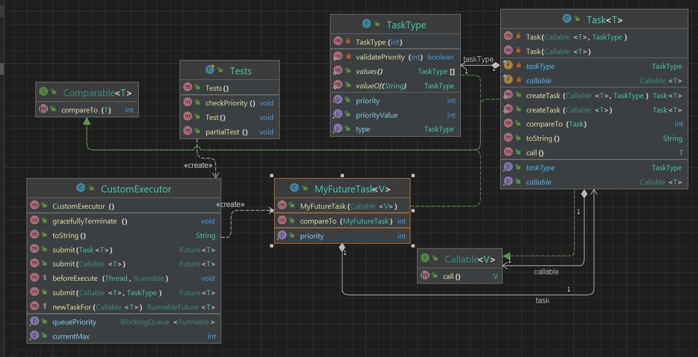

## _OOP TASK 2 -Threads_
_Authors [orel-dayan@]() & [@roy-asraf1](https://github.com/roy-asraf1)_

### Built With

* Editor : IntelliJ IDEA
* Language: Java
* JDK: 19.0.1
* JUnit 5.9.0

### Getting Start

clone this repository 
```sh
https://github.com/orel-dayan/OOP-TASK2.git
```
### Ex2_1
Run the main function and choose the number of files and max number of lines in the file in terminal.                                                               
To delete files you may use the next commands.
```sh
   cd <repository folder>/src
   rm file*
   ```
### Ex2_2
You can see and run the example in the Tests class.

## PART A:
This project provides a set of utility functions for working with text files. we create text files and calculate the total number of lines in these files.  
### We will use three methods: ####  

• Normal method without the use of threads

• Using of threads

• Using ThreadPool


### EX2_1:
A class that contains 4 functions:
- createTextFiles
- getNumOfLines
- getNumOfLinesThreads
- getNumOfLinesThreadPool

### thread:
A process (`thread`) is defined as a series of commands, which are executed serially. In a multi-process program it is possible to define several processes that are executed at the same time.
### When to use
- When we want a more "natural" solution to a problem by dividing the problem into subproblems, each of which is realized by
Another thread.
- When we want a fast response time to our input in real time.
- When we want to improve the running time of some algorithm.

### Threadpool:
A `Threadpool` is a collection of worker threads that can be used to execute tasks. When a task is submitted to the thread pool, a worker `thread` is selected to execute the task. When the task is completed, the worker `thread` returns to the pool to wait for another task. Thread pools are useful because they allow you to execute multiple tasks concurrently while limiting the number of threads that are actively executing at any given time. This can help to improve the performance and scalability of your program.
### When to use
- When you have a large number of short-lived tasks that need to be executed concurrently, a thread pool can be more efficient than creating and destroying a new `thread` for each task.
- When you want to limit the number of concurrent threads executing at any given time, you can use a thread pool to control the number of active threads.
- When you want to schedule tasks to be executed at a later time, you can use a thread pool to manage the execution of those tasks.
- When you want to execute tasks in a specific order, you can use a thread pool to ensure that tasks are executed in the desired sequence.

### Important Information:
It is important to note that using a thread pool is not always the best solution. In some cases, creating a new `thread` for each task may be more benefit. It is also important to consider the trade-offs between using a thread pool and using other concurrent execution frameworks, such as the fork-join framework or the actors model.

## Classes:
### numOfLinesThreadPool class
`numOfLinesThreadPool` is a class that implements the `Callable` interface and defines a new task that can be submitted to a thread pool.The class has a constructor that accepts a `String` name parameter and has a `call()` method that reads a file and counts the number of lines in it.The `call()` method returns the number of lines in the file as an `Integer` value. This value will be returned by the thread pool when the task is complete.
### numOfLinesThreads class
`numOfLinesThreads` is a class that extends the `Thread` class and defines a new thread.The class has a constructor that accepts a `String` name parameter and passes it to the `super` constructor. It also has a run() method that reads a file and counts the number of lines in it. the class has a getCount() method that returns the value of a counter variable that is incremented each time a line is read from the file.

## Usage
To use Ex2_1 class to Create several text files and calculate the total number of lines in these files. first insert number to the 2 next objects: numberOfFiles and maxNumberOfLines, later Implement the function with the previues objects with number to seed. After that it will automaticliiy create a new files, and will print:
- The number of lines with The time is took.
- The number of lines using Threads with The time is took.
- The number of lines using ThreadPool with The time is took.

### Conclusions
 Using a `thread pool` is a good choice for concurrent processing when you have a big number of tasks to be processed.
 It allows you to take advantage of concurrent processing while minimizing the overhead of managing multiple threads. However, for small numbers of tasks, the overhead of creating a thread pool may outweigh the benefits of concurrent processing. In such cases, using separate threads or processing the tasks sequentially may be more efficient.
 
<table>
  <tr>
    <th>Method</th>
    <th> Time (ms)</th>
    <th>Seed, Bound</th>
    <th>Number of Files</th>
    <th>Total Num of Lines</th>
  </tr>
  <tr>
    <td>getNumOfLines</td>
    <td> 5675</td>
    <td>2, 1001 </td>
    <td>1000</td>
    <td> 515033 </td>
  </tr>
    <td>getNumOfLinesThreads</td>
    <td>193</td>
    <td>2, 1001 </td>
    <td>1000</td>
    <td> 515033 </td>
  </tr>
  <tr>
    <td>getNumOfLinesThreadPool</td>
    <td>149 </td>
    <td>2, 1001 </td>
    <td>1000</td>
    <td>515033</td>
  </tr>
</table>


<table>
  <tr>
    <th>Method</th>
    <th> Time (ms)</th>
    <th>Seed, Bound</th>
    <th>Number of Files</th>
    <th>Total Number of Lines</th>
  </tr>
  <tr>
    <td>getNumOfLines</td>
    <td> 6524 </td>
    <td>2, 999</td>
    <td>1000</td>
    <td>498479 </td>
  </tr>
    <td>getNumOfLinesThreads</td>
    <td> 112</td>
    <td>2, 999 </td>
    <td>1000</td>
    <td> 498479 </td>

  <tr>
    <td>getNumOfLinesThreadPool</td>
    <td>227</td>
    <td>2, 999 </td>
    <td>1000</td>
    <td> 498479 </td>
  </tr>
</table>


## UML Part A:


# Part B:
Creating a new type that provides an asynchronous task with priority, we created a new ThreadPool type that supports tasks with
priority.

### ThreadPoolExecutor
`ThreadPoolExecutor` is a class that allows you to create and manage a pool of threads. It's part of the Java concurrency package (`java.util.concurrent`), and it provides an efficient way to run multiple tasks concurrently by reusing a fixed number of threads.
The `ThreadPoolExecutor` class provides several methods for submitting tasks to the pool, such as `submit()`, `execute()`, and `invokeAll()`. You can also use the factory methods in the `Executors` class to create different types of thread pools.
ThreadPoolExecutor class allows you to configure several aspects of the thread pool such as core pool size, maximum pool size, thread keep-alive time, etc.

###AbstractExecutorService
`AbstractExecutorService` is an abstract class that provides a base implementation for the `ExecutorService` interface in Java. It's also part of the Java concurrency package (`java.util.concurrent`). The `ExecutorService` interface provides a way to execute tasks concurrently using a pool of threads, and `AbstractExecutorService` is a convenience class that implements some common functionality for this interface.
AbstractExecutorService provides a basic implementation for the lifecycle methods of ExecutorService such as shutdown(), shutdownNow(), and isShutdown() and isTerminated().I

`ThreadPoolExecutor` class extends the `AbstractExecutorService` class to provide an actual implementation of thread pool executor service

### Callable:
`Callable` is an interface in the Java concurrency package (`java.util.concurrent`) that defines a single method, `call()`, which is similar to the `run()` method of the `Runnable` interface, but it can return a value and throw a checked exception. A `Callable` task can be submitted to an `ExecutorService` using the `submit()` method, which returns a `Future` object that can be used to check the status of the task and retrieve its result. 

### Comparable
The `Comparable` interface is a functional interface in Java that defines a single method `compareTo(T o)`. The purpose of this interface is to define a natural ordering for objects of a certain class. Classes that implement this interface are called "comparable".

## Classes:
### TaskType
enum `TaskType` represents different types of tasks. The enum in this class has 3 constant values `COMPUTATIONAL`, `IO` and `OTHER`. And also it has following field and methods: `typePriority` which represents an integer value that ranges from 1 to 10, and it is used to store the priority of the task type.constructor with int  parameter which takes an integer value and assigns it to `typePriority` and validate if the value is valid using validatePriority method `setPriority` method which set the new priority to `typePriority` if the passed value is valid `getPriorityValue`what the meaning o method which return the current priority value getType method which return the current type
validatePriority method which check if the priority passed is valid or not.

### Task
This is a class called `Task` that implements the `Comparable` interface and the `Callable` interface. `Task` class is a generic class, as it uses the T generic type. It has two fields, taskType of type `TaskType` and callable of type `Callable<T>`. This callable field allows the class to store an instance of a `Callable` task and execute it later. The `Task` class has two constructors, one of them takes two parameters `Callable<T>` and `TaskType`, the other takes one parameter `Callable<T>` and will set the `TaskType` to `OTHER.` The class also defines two static methods `createTask`, one of them takes two parameters `Callable<T>` and `TaskType`, the other takes one parameter `Callable<T>` and will set the `TaskType` to `OTHER.` Both of them create a new instance of `Task<T>` and return it.

### Factory design patrren:
In order for us to want a method that will hold an object from one of several options when all the objects have some common denominator. Usually we used that design patrren when we dont know what the function we need. its also a way to hide the sub classes and the sub constructors.
In our project we used this design patrren in the function of `createTask` so that there will be no access to the constructor.

It has also the following methods:
- `getCallable` : which return the callable field
- `getType` : which returns the priority value of the taskType
- `toString` : which returns a string representation of the Task object
- `compareTo`: which compares the priority of two tasks
- `call`: which is the implementation of the Callable<T> interface, it will call the call method of the callable field and returns the result.
- This class represents a wrapper around a Callable

### MyFuture:
`MyFuture` is extending the `FutureTask<V>` which is a concrete implementation of the `Future<V>` interface. It is also implementing the `Comparable` interface.
The `MyFuture` class has one field priority that represents an integer value. It has a constructor that takes a `Callable<V>` and an int parameter and pass the `Callable<V>` to the constructor of the `FutureTask<V>` super class and assigns the int parameter to the priority field. The class has a method `compareTo(MyFuture o)` which is implementation of the compareTo method of the `Comparable` interface, it compares the priority of two `MyFuture` objects, and it's used to sort the collection of `MyFuture` objects based on their priority. It also has `getPriority` method which return the current priority. This class is designed to handle future asynchronous tasks with priorities. The `MyFuture` class adds a new feature to `FutureTask` which is the ability to assign a priority to the task. This class by extending the `FutureTask` class which already provides the functionality to run a task asynchronously, it adds the ability to prioritize tasks, which can be useful in situations where some tasks need to be executed before others.

### Adapter Design Pattern:
Allows classes to work together even though they have incompatible interfaces. In the class FutureTask we have 2 interfaces: `Callable` and `Runnable`, Since we were only asked to implement Callable beacuse of that we used Adapter design pattren And we created a kind of "correlation" between them his name is `MyFuture`.
`MyFuture` extends only the method of `Callable` from `FutureTask`.

### CustomExecutor:
The class is implemetation of the `ThreadPoolExecutor` class called `CustomExecutor`. `CustomExecutor` uses a `PriorityBlockingQueue` to hold the MyFuture tasks, this queue is able to hold a collection of tasks and orders them based on the priority of each task. It also keeps track of the number of tasks for each priority using an array priorityCounts.

The class has four constructors:
A default constructor that creates a new thread pool with the number of available processors in the system and a default `PriorityBlockingQueue` and defines some properties such as core pool size, maximum pool size and keep-alive time. It overrides the newTaskFor method from `ThreadPoolExecutor` to return a `MyFuture` object for a new task, this method is used to create new instances of `MyFuture` for the `ThreadPoolExecutor` to use when a new task is submitted.
It also has three methods that are used to submit a task to the thread pool:
- `submit(Task task)`: which is used to submit a Task object to the thread pool and increments the priority count
- `submit (Callable task, TaskType taskType)`: which is used to submit a Callable task with a TaskType object to the thread pool
- `submit (Callable task)`: which is used to submit a Callable task with TaskType object is set to OTHER
It also has two methods:

`getCurrentMax()` which returns the current maximum priority count. `gracefullyTerminate()` which calls the `shutdown()` method of the `ThreadPoolExecutor` to terminate the thread pool. It also overrides the beforeExecute method to decrement the priority count of the task before it is executed. This `CustomExecutor` allows to schedule and execute the tasks according to the priority assigned to them and it also allows tracking the number of tasks for each priority

## UML Part B:



